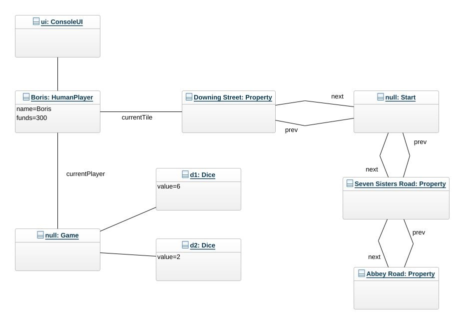
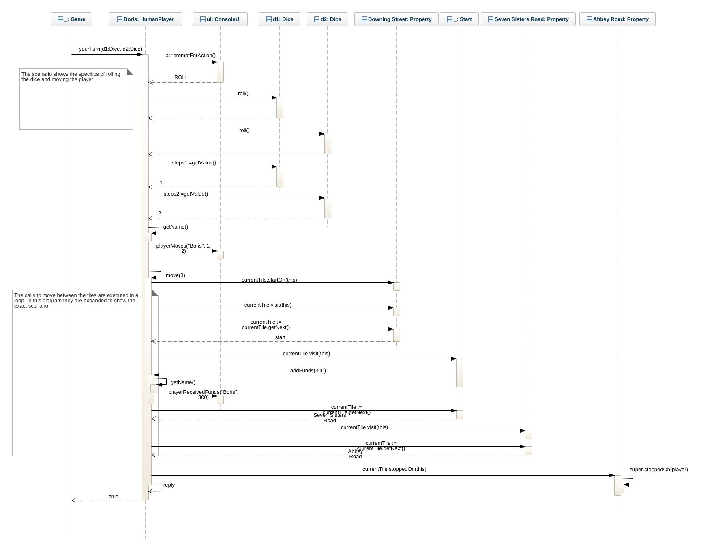
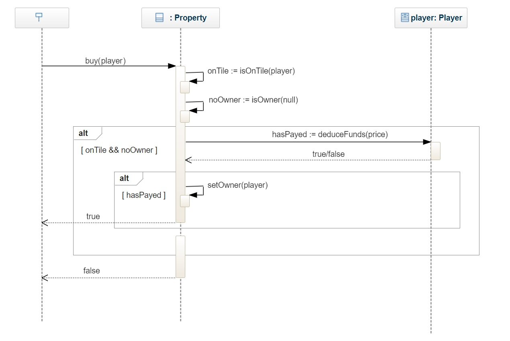

# Monopoly Game OO-Design
This document describes the design according to the requirements presented in assignment2. The overall goal was to prepare for a computer player, and to spread the complexity/behavior over multiple classes to not end up with a central class that does everything.

## Overview
The following describes the most central classes in the design and their responsibilities. These are the classes that contain most of the behavior i.e. the rules of the game.

### Game
Responsible for creating the board, dice, ui, and players. It also runs the main game loop, and handles the game rounds with the rule to that the player must roll again if dice have an equal score.

### HumanPlayer
Represents a human player and uses the ui to prompt for actions etc. Contains the rules for moving itself over the tiles, and handling its own funds. Extends the Player interface, to prepare for a computer player alternative, although it is likely that some of the functionality from HumanPlayer is also needed in a computer player.

### Tile Hierarchy
Tiles are structured as a circular doubly linked list where each tile links to the next and previous tile.
A tile gets different messages when a player object stars, passes over or stops at the tile. In that way different behaviors can be triggered.
Tile subclasses are responsible for their specific rules when a player, starts, stops or moves over a tile. Property tiles encapsulate the rules for buying a property and paying rent for it. Start tile is responsible for handing out funds when passed. More types of tiles could be created in this way.

## Future Improvements to Consider
 * Consider a messaging interface for the ConsoleUI to extend. For example the HumanPlayer class does not really need to know about the whole ConsoleUI. It would also make for a more adaptive design where the UI could ultimately be changed to something else.
 * In the Player class the operations payRent and deduceFunds are doing almost the same thing (there are some differences). Possibly deduceFunds could be have some parameters and we could live without a separate payRent operation.
 * If the introduction of a computer player results in code duplication from HumanPlayer, consider adding an abstract base class e.g. PlayerBase and consolidate common behavior in this.
 * Tile hierarchy could be in its own package
 * Tile hierarchy could be extended with more subclasses to represent other types of tiles (Jail, Card tiles etc)

## Class diagram

## Move Player Boris Scenario
Corresponds to the scenario in the assignment description.

### Initial state object diagram
Shows relevant objects for the initial state of the scenario

### Sequence Diagram
Shows the exact calls made to execute the sequence diagram. Note that in the implementation there is more flexibility (e.g. if statement to handle other choices and loops to handle variable number of steps). In this diagram we focus on the exact scenario as described.

## Property Buy
### Sequence Diagram
Show the exact calls that should be made to implement the Property.buy operation.

